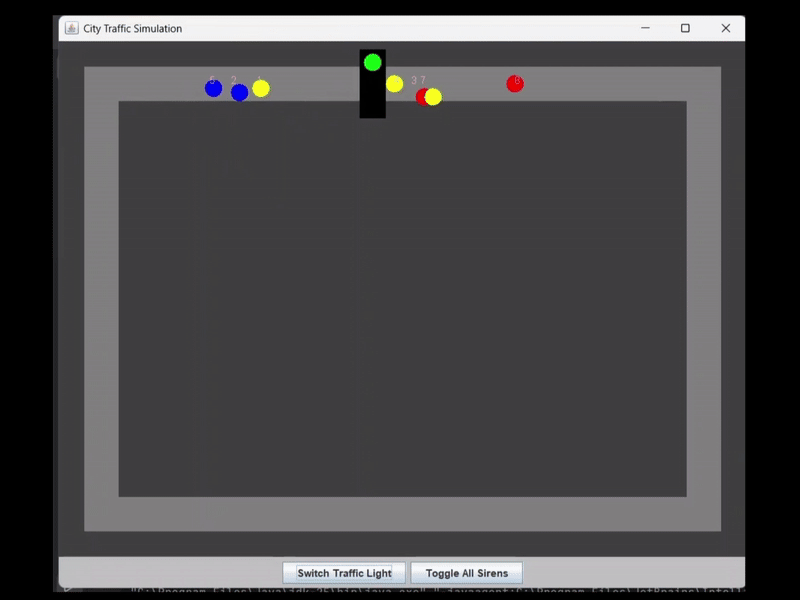

# 🚦 Intelligent Traffic Simulation

A Java-based traffic simulation engine visualizing Object-Oriented Design Patterns in action. 
Vehicles navigate a track, obey traffic laws, and react dynamically to emergency situations using a custom MVC architecture.

## 🚀 Key Technical Concepts
This project demonstrates advanced Java concepts without reliance on external engines:

### 1. Design Patterns
* **Observer Pattern:** Vehicles "subscribe" to the Traffic Light. When the signal changes, vehicles react instantly without tight coupling or polling.
* **Strategy Pattern:** Encapsulates driving behaviors. Ambulances dynamically switch from a "Standard" strategy to an "Aggressive" strategy (ignoring red lights) when sirens are toggled.
* **Factory Pattern:** A robust loader reads from CSV files (`vehicles.csv`) to instantiate specific subclasses (`Car`, `Bus`, `EmergencyVehicle`) based on string input.

### 2. Advanced Java Features
* **Generics & Bounded Types:** Implements a type-safe `Garage<T extends Vehicle>` system. This ensures that specific depots (e.g., a `Garage<Bus>`) only accept the correct vehicle types while sharing common repair logic.
* **Custom Sorting (Comparators):**
    * Implements `Comparable` for natural ordering of vehicles by ID.
    * Uses custom `Comparator` classes to sort fleets based on complex criteria, such as Speed and Location, useful for prioritization logic.
* **Polymorphism:** A heterogeneous fleet is treated as a generic `List<Vehicle>`, yet each object executes unique `move()` and `onLightChange()` logic.

### 3. Algorithm Design
* **Safety Audit:** A custom algorithm iterates through the fleet to identify the "Most Dangerous Vehicle," prioritizing rogue emergency vehicles over standard speeders.
* **Collision Avoidance:** Vehicles calculate braking distance to stop exactly at traffic lines without clipping into the intersection.
